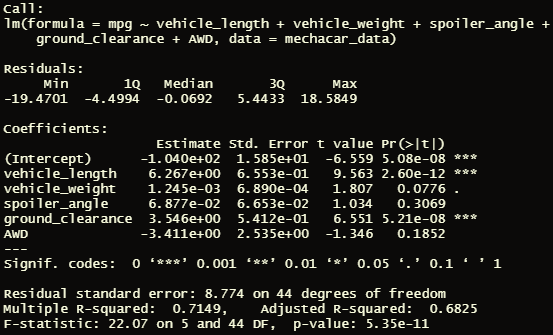
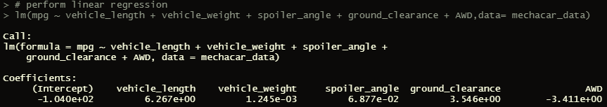
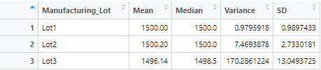
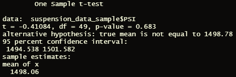
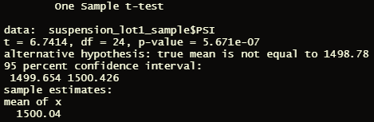
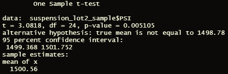

# MechaCar Statistical Analysis

## Project Overview
The purpose of this project was to analyze datasets of a MechaCar automobile prototype to predict average miles per gallon (MPG), summary statistics of suspension coil pounds per square inch (PSI), perform statistical analyses such as t-tests, and use the data interpret the findings and compare them against vehicles from other manufacturers. 

## Linear Regression to Predict MPG

 

1. **Which variables/coefficients provided a non-random amount of variance to the mpg values in the dataset?** 
Vehicle length, vehicle weight, andground clearance were three out of the six total variables that provided a non-random amount of variance because their p-values were all less than 0.05 alpha (threshold) value.

 

2. **Is the slope of the linear model considered to be zero? Why or why not?** 
*answer*

3. **Does this linear model predict mpg of MechaCar prototypes effectively? Why or why not?** 
*answer*

## Summary Statistics on Suspension Coils
### Summary
summary here

### Total Summary
 

### Lot Summary
 

## T-Tests on Suspension Coils
### Summary
summary here

### Total Summary
 

### Lot Summaries

Lot 1 
 

Lot 2 
 

Lot 3 
 

## Study Design: MechaCar vs Competition
### Study Description
description here

1. **What metric or metrics are you going to test?** 
*answer*

2. **What is the null hypothesis or alternative hypothesis?** 
*answer*

3. **What statistical test would you use to test the hypothesis? And why?** 
*answer*

4. **What data is needed to run the statistical test?** 
*answer*

